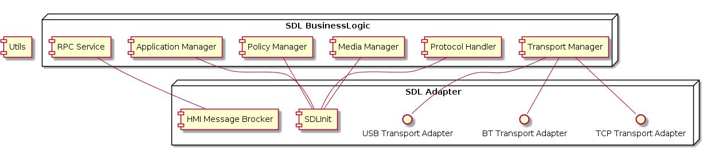

# Specify SDL Adapter Layer

* Proposal: [SDL-NNNN](nnnn-oem-adapter-layer.md)
* Author: [Alexander Kutsan](https://github.com/LuxoftAKutsan)
* Status: **Awaiting review**
* Impacted Platforms: [Core / iOS / Android / Web / RPC / Protocol]

## Introduction

This proposal is about splitting SDL into **business logic** part and **SDL adapter** part.

**SDL business logic** should contain platform agnostic code. All features of SDL are implemented in that layer.  
**SDL adapter** should implement interfaces which SDL business logic will use for communication with user, platform, devices. 

## Motivation

Integration of SDL is a complicated process. 
Integration of each new release of SDL requires big amount of additional resources and efforts.
Dependency management in SDL project is complicated and not obvious. 

Each OEM hardware has its own approach for communication with mobile devices.
Now entire SDL components should be replaced for porting SDL to specific OEM hardware.

Currently it is not obvious for SDL contributors that some components should not contain platform specific code,
and should not contain business logic to avoid integration issues. For SDL integrators it is not obvious whether some components contain business logic or not, and if they can be safely replaced by OEM implementation.

## Proposed solution

The proposed solution is to extract platform specific parts and parts that may be replaced for integration of SDL to OEM infrastructure to a separate component called **SDL adapter**. 

### Architecture splitting of SDL parts:

Extract the following components to SDL Adapter:

- Transport Adapters 
- HMI MessageBrocker
- SDL initialization

Big picture of SDL Adapter 

 

### Scope of responsibilities and interfaces of SDL business logic component

**SDL business logic** component contains whole functionality of SDL :  

 - SDL protocol
 - Application management
 - Handling and processing RPCs
 - Resumption functionality
 - Policy functionality
 - State management

**SDL business logic** component should provide SDL adapter with the following interfaces: 
 
#### HMIMessageObserver

Interface is used by **HMI Message Handler** to notify SDL about new HMI messages. 

###### Methods: 

- `void OnMessageReceived (SPtr<HMIMessage>)` : Called by HMI Message Broker when message from HMI was received 
- `void OnErrorSending (SPtr<HMIMessage>)` :  Called by HMI Message Broker if sending message to HMI was failed 

### Scope of responsibilities of SDL adapter

### Open source SDL adapter

#### LifeCycle 

Component is responsible for SDL startup, it initializes all components of SDL and injects dependencies. 

Components should contain main.cc with `main` function that will be called when application starts.

Functions which sdl_adapter should provide in LifeCycle component: 

 - `main` is the function that will be called on application startup 
 - `StartComponents` is the function that initializes all components and startup SDL
 - `StopComponents`  is the function that stops and deletes all SDL components 

#### HMIMessageSender 

Components that are responsible for sending message to HMI: 

- `void SendMessageToHMI (SPtr<HMIMessage>)`: Send message to HMI (Put in queue for sending)
- `size_t GetNumberMessagesInQueue ()`: Return amount of messages that queued for sending to HMI, but not yet sent
- `void RemoveMessagesByIds (vector<id>)`: Removes certain messages from queue for sending to HMI

The components work in async mode. Calling `SendMessageToHMI` actually puts a message to the queue for sending to HMI. 

#### Transport Layer

Transport layer is the most significant part of **SDL adapter**.  
The following list of interfaces should be implemented for each transport type: 
 - TransportAdapter
 - ServerConnectionFactory
 - DeviceScanner
 
##### TransportAdapter
Class is responsible for sending/receiving data to/from device. 

 - `void Init()` : initialize Transport Adapter functionality 
 - `void Terminate()` : terminate communication with device, close connection. 
 - `void AddListener(TransportAdapterListener)` : add Listener for Transport adapter events. TransportAdapter should notify listener about events. 
 - ` Error SearchDevices()` : Start searching for devices. List of new devices will be supplied in TransportAdapterListener::onDeviceListUpdated callback.
 - `Error SendData(DeviceUID, ApplicationHandle, data)` : Send data to specific application on Device.
 - `Error SendData(DeviceUID, ApplicationHandle, data)` : Send data to specific application on Device.
 - `DeviceList GetDeviceList()` : Get list of devices, handled by Transport adapter
 - `ApplicationList GetApplicationList(const DeviceUID& device_handle)` get list of applications, available on certain transport. 
 - `void TransportConfigUpdated(TransportConfig)` : Applies updated Transport Configuration
 - `std::string GetConnectionType()` :  Obtain connection type used by device.
 - `void RunAppOnDevice(DeviceUID, bundle_id)` : Run specific application on device

##### ServerConnectionFactory 

Implement transport dependent connection that was originated by the user.

 - `Error Init()` : Start server connection factory. 
 - `Error CreateConnection(DeviceUID, ApplicationHandle) ` : Create transport independent abstraction of connection
 
##### Device Scanner 

Transport dependent device scanning component

 - `Error Scan()` : Start device scanning
 - `void Terminate() ` : Stop Device scanning

##### LowVoltageSignalHandler

Component should implement platform specific way of handling low voltage signal and notifying business logic about it. 

 - `LowVoltageSignalsHandler(LowVoltageSignalsListener)` : Constructor for signal handler.  

### Using modern CMake approach

SDL may use a modern cmake approach for targets creation. It will simplify porting SDL to any platform. 

#### Use CMake namespaces 

Propose to use cmake with namespaces for all SDL components and dependencies.  
This best practice of cmake allows:
 - To make clear components dependencies;
 - To avoid dependency gaps (required for multi-threading compilation);
 - To keep components independent;
 - To understand components interfaces;
 - To unify external dependencies management.
 
Here are the drawbacks of the current structure of cmake usage:
1. Existing cmake structure does not allow easy and seamless integration to other operating systems.
2. Existing cmake structure has no unified management system of 3rd party libraries.
3. With existing cmake structure we have problems with components and libraries dependencies, and the modern approach should resolve it.

This new approach will make cmake files more clear and lightweight.

#### target_<link_libraries,include_directiries>

SDL CMake files should avoid using global cmake commands for adding compiler flags, include directories, linkage libraries, etc ...

Theses functions pollute the project compilation structure, add hidden dependencies between components, and make cmake files unclear and confusing.

SDL CMake files should explicitly specify include directories, link libraries, compiler options for entire target that it compiles.

#### New Cmake approach. Detailed design 

##### SDL core repository structure:

 - `/CMakeLists.txt`: contains common build configs for all projects, include directories with some builds utils and helpers;
 - `/src/`: contains all sources of the project;
 - `/src/components`: contains sources of SDL Core components;
 - `/src/components/sdl_adapter`: contains sources of SDL Adapter components;
 - `/src/components/sdl_logic`: contains sources of SDL business logic components;
 - `/src/components/utils`: contains sources of Utils componnts that used both in SDL Adapter and SDL business logic 
 - `/src/3rd_party`: contains sources of 3rd party components;
 - `/src/appMain`: contains sources of SDL Core main executable and config files for runtime;
 - `/src/docs/`: contains doxygen template for Software Detailed Design (SDD) document generation;
 - `/src/tools/`: contains tools for work with repository, helpers, formatters, git hooks, etc;
 - `/cmake`: contains additional cmake files with common code across components;
 - `/cmake/toolchains`: contains compilation toolchains for different platforms;
 - `/cmake/helpers`: contains cmake helpers with common code across components;
 - `/cmake/dependencies`: contains cmake file for finding certain dependency on the system.

Each folder should contain a README file with descriptions of contents and examples of usage if applicable.

##### 3rd party libraries management:

By default build system should not install to the system any additional libraries during compilation. 

If required version of certain dependency is available on the system, build system should use it.

If required version of certain dependency is missed on the system, its build system should compile it and keep in `<build>` folder within `make` command.

**External dependencies** - dependencies that build system should download from official sources during cmake run.  
**3rd party dependencies** - dependencies that build system should keep as sources in `src/3rd_party` directory.

SDL is responsible for 3rd party dependencies in the code and fixes that may also be applied to this code.

The list of SDL dependencies: 
  - boost : **external dependency**, if it was not found on the system, build system should download sources from official sources during `cmake` command run and compile within project during `make` command run.
  - libapr : **3rd party dependency**, if it was not found on the system, build system should take sources from `src/3rd_party/` and compile within project during `make` command run.
  - libaprutils : **3rd party dependency**, if it was not found on the system, build system should take sources from `src/3rd_party/` and compile within project during `make` command run.
  - liblog4cxx : **3rd party dependency**, if it was not found on the system, build system should take sources from `src/3rd_party/` and compile within project during `make` command run.
  - bson-clib : **external dependency**, if it was not found on the system, build system should download sources from official sources during `cmake` command run and compile within project during `make` command run.
  - json : **3rd party dependency**, if it was not found on the system, build system should take sources from `src/3rd_party/` and compile within project during `make` command run.

######  3rd party libraries installation rules

Compilation of libraries should not trigger their installation to the system by default.

It is proposed to use special CMAKE variable if user desires to install 3rd party libraries to the system: `THIRD_PARTY_INSTALL_PREFIX`.

If this variable is empty, SDL should install 3rd party and external dependencies libraries to `{BUILD_DIR}`/compile_dependencies

During `make install` SDL should copy all files required for SDL RUN to `{BUILD_DIR}`/bin, and libraries required for SDL RUN to `{BUILD_DIR}`/bin/lib.

## Potential downsides

## Impact on existing code

## Alternatives considered
